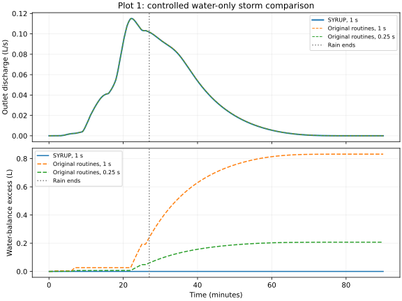

# Phase 4 — accepted CPU water-only storm milestone

2026-09-29. Rainfall, retained soil water, infiltration/drainage, MAHLERAN method-5 routing, depth and discharge now run together on the actual MAPLE Plot 1 case. The coupled driver retries rejected hydraulic steps transactionally, preserves forcing boundaries, records true per-step peaks and retains residual water. MAPLE sediment state is unchanged. Numba compiles the ordered hydraulic sweep; the array implementation remains the comparison/backend path.

Claude authored and corrected the storm implementation; Codex independently reviewed and tested it. Claude separately reviewed Codex's original-Fortran benchmark and three small validation/boundary/test fixes: no must-fix findings. Review evidence is archived under `agent_handoffs/tasks/phase4c_storm/` and `phase4d_reference/`. Phase 4 changes remain uncommitted.

## Matched experiment

The 60 × 20, 0.5 m Plot 1 domain has 1,200 active cells, 10 south outlets and 66 routing levels. Rain delivers 9.652 mm (2.8956 m³) over 1,620 s, followed by recession to 5,400 s. Initial retained soil water is 22.5 m³; initial surface water is zero. Parameters are pavement/Hawkins infiltration, deterministic XML mean Ksat 2.5e-7 m/s, suction 0.0466 m, soil thickness 0.3 m, initial theta 0.25, drainage parameter 0.05, and constant friction 21.45. Case identity, graph, forcing, source and artifact hashes are in [the measurements](storm_comparison.json).

`benchmarks/phase4/storm_reference.py` builds unchanged original `infilt`, `route_water`, `update_water_flow` and required modules with an instrumented driver. This is an **executed original-routine, controlled water-only benchmark**, not the full MAHLERAN application. Both runs use the same case, parameters and exact interval-ending forcing. The harness bypasses XML initialization, stochastic conductivity and the legacy rainfall switching lag; original single-precision infiltration literals remain. Dummy zero sediment arrays support the original update routine. Method 5 does not require `accumulate_flow`. Reference history is bounded to 100,000 steps.

SYRUP deliberately recomputes receiver old inflow from the same post-infiltration donor fluxes, uses a proven root bracket and closes storage conservatively. The original routines retain their stale old inflow and legacy bracket. Neither legacy issue is copied into production to force agreement.

| Timestep (s) | SYRUP export (m³) | Original export (m³) | SYRUP difference | Original water excess (m³) |
|---:|---:|---:|---:|---:|
| 1 | 0.1644330883 | 0.1650566104 | −0.3778% | 0.0008317069 |
| 0.5 | 0.1644458497 | 0.1647570515 | −0.1889% | 0.0004151266 |
| 0.25 | 0.1644522365 | 0.1646077117 | −0.0945% | 0.0002074312 |

SYRUP export changes by only 0.01165% between 1 and 0.25 s. At 1 s its peak discharge is 0.00011507245 m³/s at 1,333 s; the original peak is 0.00011509476 m³/s at 1,334 s. At rainfall end, spatial depth RMSE is 9.12e-7 m and maximum absolute difference is 5.40e-6 m against an original maximum depth of 0.004760 m. Velocity RMSE is 5.98e-6 m/s. These comparisons test a wet spatial state, not just the all-dry final surface.



At 1 s, SYRUP's global water residual is 4.26e-14 m³ (declared tolerance 1.99e-9 m³). Final surface water and outlet discharge reach zero naturally; soil retains 25.21685517 m³ and drainage totals 0.01431174 m³. There is no dry reset. No attempted step was rejected in the three production refinements; dedicated tests exercise retry and rollback paths.

The original's 0.0008317069 m³ excess separates into 0.0008316892 m³ measured stale-inflow gain and 1.7762e-8 m³ accumulated root closure residual, leaving −6.94e-14 m³ unexplained rounding. One tiny bracket-end truncation is detected at 1 s; maximum cell closure residual is 2.87e-9 m. The export difference is consistent with this legacy creation and diminishes with timestep, but this experiment does not uniquely attribute every export difference to it: literal precision and root treatment also differ.

## CPU cost and memory

Sequential fresh processes, same case, 1 s report cadence, no concurrent benchmarks:

| Implementation / dt | Storm-loop wall seconds | Peak process RSS (MiB) |
|---|---:|---:|
| Numba / 1 s | 7.842 | 362.1 |
| Array / 1 s | 75.954 | 319.4 |
| Numba / 0.5 s | 14.979 | 362.3 |
| Numba / 0.25 s | 28.813 | 362.2 |

All final grids and every saved hydrograph array match **bitwise** between array and Numba at 1 s. The loop ratio is 9.69× for this small case, not a universal speedup. Numba's first accepted step takes 0.492 s including import/JIT; the other 5,399 steps take 7.349 s. Peak RSS includes MAPLE case loading, Python and compilation, not just hydraulic workspace. These are single-run measurements on this machine. Larger synthetic routing costs are documented in [the earlier kernel acceptance](acceptance.md).

The original Fortran build is unoptimized with runtime checks and additional full-grid diagnostics; its execution time is not used for a speed comparison. GPU performance and memory have not been measured.

## Verification and reproduction

Full regression: **366 passed, 5 skipped in 55.71 s**. All skips require unavailable GPU support; original-Fortran tests executed. Ruff and whitespace checks passed. Tests cover conservation, forcing alignment, refinement, backend parity, true peaks, namespace validation, failed-attempt immutability and runner provenance. Full regression command uses the interpreter and isolated compiler settings shown in [kernel acceptance](acceptance.md), with `PYTHONPATH=src:/tmp/syrup-numba` and `pytest -p no:cacheprovider -q`. Numba 0.67.0, llvmlite 0.49.0, NumPy 2.5.2, Python 3.12.3, GNU Fortran 13.3. Reference trees/environments were not modified.

From the repository root, for each DT in 1, 0.5 and 0.25 (each output must be new):

```bash
PYTHONDONTWRITEBYTECODE=1 GIT_OPTIONAL_LOCKS=0 PYTHONPATH=src:/tmp/syrup-numba \
/home/okin/MAPLE/.venv/bin/python -m maple_syrup.storm_experiment \
  --case-dir outputs/plot1 --output-dir NEW_SYRUP_DIR \
  --max-dt-s DT --end-s 5400 --report-every-s 1 --implementation numba

# Set MAPLE_SYRUP_GFORTRAN and compiler flags as in acceptance.md.
PYTHONDONTWRITEBYTECODE=1 GIT_OPTIONAL_LOCKS=0 PYTHONPATH=src:tests/phase4 \
/home/okin/MAPLE/.venv/bin/python benchmarks/phase4/storm_reference.py \
  --case-dir outputs/plot1 --output-dir NEW_REFERENCE_DIR --dt-s DT --end-s 5400
```

Also run SYRUP with `--implementation array` at 1 s and both solvers to 1,620 s. Archived commands/stdout/stderr include `/usr/bin/time -v` for production runs. Raw production outputs are in `outputs/phase4_storm/`; final reference outputs in `outputs/phase4_reference_final/`. `benchmarks/phase4/compare_storm.py` reads those exact paths to regenerate the curated JSON and SVG. Temporary tool installations under `/tmp` are not permanent dependencies; use the optional Numba extra in an isolated persistent environment for subsequent work.

## Limits and next work

Accepted: this CPU water-only milestone, with a static draining D4 graph and fixed friction. Not accepted or implemented here: GPU execution, wet sediment pickup/transport/deposition, terrain refresh, pits/overtopping, production restart, event completion/dry handoff, splash, wind alternation, vegetation or ecohydrology. Retained soil water is not discarded when surface flow ends.

**Phase 4R is an important follow-up:** investigate cheaper implicit solves and GPU-friendly execution, plus explicit kinematic/local-inertial alternatives, against this conservative baseline; see [the literature/design review](solver_alternatives.md). Phase 5 then adds conservative sediment exchange with actual MAPLE holdings. Neither is implied by water-balance closure alone.
