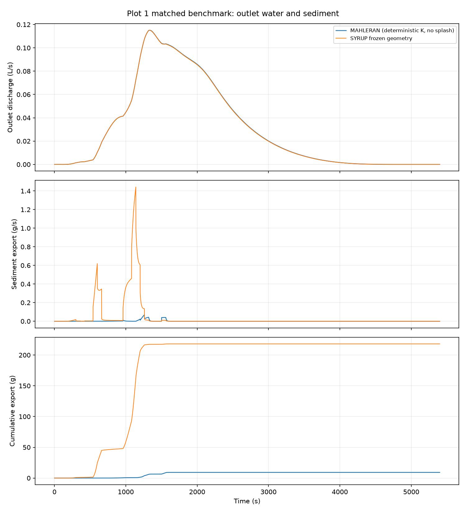
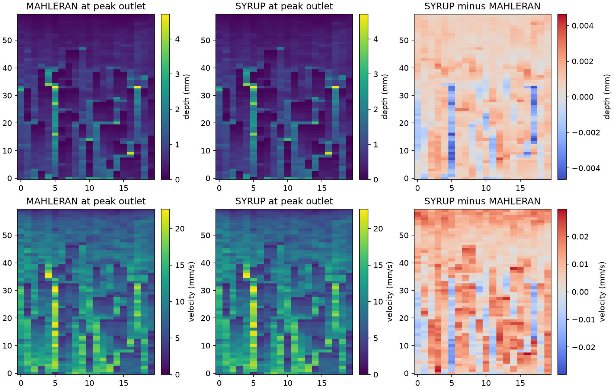

# Phase 7 benchmark and qualification report

Status: **diagnostic benchmark milestone completed and independently reviewed**.
Whole-storm sediment fidelity remains **unqualified**; Phase 7 scientific
qualification is open pending the recorded Phase 7b work. Phase 6's separately reviewed CPU completion and
restart milestone remains accepted within its documented scope.

## Contract and provenance

Full Plot1, 60 × 20 active cells, 0.5 m cell width, six sediment classes,
5400 s. Hydraulic elevation and routing are frozen; actual MAPLE sediment
holdings, availability, refill, deposition, mobile storage and boundary export
remain active. Direct dry-cell splash is disabled in the isolated MAHLERAN
reference; rain-assisted wet detachment remains. No dry reset, terminal commit,
restart or wind handoff is performed by this benchmark.

Both runs use deterministic hydraulic conductivity 0.00025 mm/s and the
recorded applied legacy rainfall, including its one-second switching lag.
The rainfall depth is 9.656233333 mm over 300 m². MAHLERAN's default
positive-truncated random conductivity is deliberately not confused with
its nominal mean; see [initialization audit](initialization_audit.md).

Production SYRUP source SHA256:
`01709bb52720923aa9b7211409d7ffd19155c4a9bfc87c36d9e1f0180a58d532`.
Actual MAPLE dependency source SHA256:
`d3d007024ff65abc2a0ff179f0f03bcd1c3b27f091493136cce849c34f7a4264`.
MAHLERAN executable SHA256:
`49c064f44740f54360839fcaafdc9e1ea7beeb025157a23279ab8ac24bb350cb`.
Each run binds input/output hashes; the source is unchanged during qualification.
No live MAPLE/MAHLERAN checkout or Python environment was modified.

## Matched storm results

Outlet endpoint-discharge integral differs by −0.377848%; peak discharge by
−0.016601%; SYRUP peaks at 1334 s inside MAHLERAN's rounded 1328–1342 s
plateau. All three predeclared hydrological targets pass. The conservative
SYRUP face-volume export is 0.1644499370 m³; it is not the endpoint-sum
quantity used for the legacy comparison.

Sediment export is 0.2181098243 kg versus 0.00922324708 kg from MAHLERAN,
a ratio of 23.6478. This does **not** establish sediment fidelity.
Requested detachment is 453.081467 kg versus 452.8581 kg from the rounded
legacy demand map (0.0493% difference); actual MAPLE pickup is 411.057878 kg,
with 42.023590 kg refused by availability and no holdings shortfall. All
requested pickup in this case is rain-assisted; concentrated-flow and
suspension regimes are not exercised.

Water closes to 3.77e−14 m³ under its MAPLE-derived 5.81e−7 m³ bound. Largest
class sediment residual is 8.73e−11 kg under the unchanged actual MAPLE
1.94e−6 kg bound. Deposits/exports were supplied, no negative mass was erased,
and all geometry/ledger validations passed. Conservation is necessary but
does not explain away the export discrepancy.

## Correct spatial comparisons

A source audit corrected a comparator error: MAHLERAN's `depth001.asc` and
`veloc001.asc` are synchronous snapshots at maximum outlet discharge
(`output_hydro_data_xml.f90`, lines 489–506), not each cell's storm maximum.
The initial `outputs/phase7/comparison_dt1` depth/velocity metrics and related
plots are invalid for fidelity assessment and are retained only as audit
history. Corrected comparisons explicitly omit these unmatched metrics.
A read-only observer captures SYRUP's synchronous peak-outlet snapshot for a
separate comparison, without changing any production result.

Legacy detachment/net-erosion maps are accumulated demands, not a measured
finite-bed inventory. They must be distinguished from MAPLE's actual pickup
and bed change. Four-significant-digit legacy files cannot be tested with
SYRUP's internal FP64 reservoir tolerance.

## Performance and backend qualification

Standalone dt1 full SYRUP process: 195.58 s wall, peak RSS 358312 KiB
(349.9 MiB). Coupled loop 192.23 s; first accepted step 0.559 s includes
first-use Numba work/cache loading; remaining mean 35.50 ms/step. This is one
observational sample on Intel i9-7900X, not a universal throughput estimate.
The isolated checked MAHLERAN whole program ran the deterministic case in
9.297 and 9.398 s. This is an approximately 21-fold **whole-program** cost
contrast, not a water-solver speed ratio: the models' sediment methods,
validation, inventory and diagnostics differ substantially. Earlier
water-routine-only comparisons remain in Phase 4 evidence.

Actual CUDA execution was enabled in an isolated `/tmp` installation:
CuPy 14.2, CUDA runtime/NVRTC 12.9, GTX1080Ti (compute 6.1); live MAPLE's venv
is untouched. Device tests and measured wet-law/transport kernels pass
host/device parity. An empty-face CuPy scatter failure was fixed by skipping
zero-length x/y diagnostic scatters in SYRUP; the pinned MAPLE source is
unchanged. Both pure-direction topologies now pass.

Synchronized five-repeat medians for converging-valley, six-class kernels:

| Cells | CPU laws / transport (ms) | GPU laws / transport (ms) | CuPy pool reserved (MiB) |
|---:|---:|---:|---:|
| 1,200 | 1.794 / 1.281 | 10.946 / 18.680 | 3.48 |
| 19,200 | 21.289 / 22.682 | 11.395 / 19.503 | 55.21 |
| 76,800 | 95.182 / 93.300 | 10.713 / 27.018 | 220.13 |

These timings exclude initial host/device setup and actual MAPLE exchanges,
water routing, infiltration, reporting and commits. They include the kernel
validation synchronizations. Pool reservation is **not** total device peak
memory. Full coupled GPU events, their transfer cost and peak memory remain
unsupported/unqualified; kernel acceleration does not establish end-to-end
GPU acceleration.

## Verification and pending completion

Full CPU regression: 513 passed, eight device tests skipped, 139.06 s;
original Fortran checks executed. All eight skipped device checks subsequently
passed with real device access, plus two CPU face-topology cases. The initial
GPU parity check's arbitrary near-zero residual comparison was replaced with
independent enforcement of the unchanged MAPLE bound on both backends;
physical arrays still undergo direct parity checks.

Timestep refinement, full CPU-backend parity, synchronous spatial comparison
and larger-domain coupled CPU measurements are complete. Corrected comparator:
nine focused tests passed in 1.82 s; lint passed. Final independent Claude
review found no blocking defect; see [Codex disposition](review.md). No commit or push performed in this phase.

## Completed diagnostic investigations

The full array run matches the Numba run exactly across all 97 saved numerical
arrays (hydrograph, final state, forcing). Its independent observer sees 5400
successful coupled steps, no rejected attempts, and reproduces the event's
outlet peak time/value. Thus its additional synchronous snapshot and
pickup-weighted distance diagnostics apply to the dt1 Numba result too.
At each model's own peak outlet discharge, relative L2 depth difference is
0.136173%, velocity difference 0.121216%; maximum absolute differences are
0.00464722 mm and 0.0299170 mm/s. The legacy's unrounded peak time is not
stored; its rounded plateau is 1328–1342 s versus SYRUP's exact 1334 s.

The pickup-weighted observer finds 99.9011% of requested mass has finite mean
travel distance less than the 0.5 m cell width. Class 1's weighted median is
in 0.0562–0.1 m and class 2's in 0.0178–0.0316 m. These are local means at
pickup, not measured particle lifetimes or tracked trajectory distributions.

A controlled constant-law impulse at an outlet demonstrates a spatial issue
in the actual current operator. With cell width 0.5 m, velocity 0.01 m/s and
mean distance 0.05 m, the exponential distance convention in MAHLERAN assigns
survival beyond the first cell `exp(-dx/L) = 0.0000453999`. SYRUP's actual
reaction/advection operator exports 0.0915624 of the unit impulse at dt1 and
0.0911050 at dt0.25. The independent geometric-series calculation matches
both. The upwind mixing limit as dt → 0 is `L/(L+dx) = 0.0909091`, so temporal
refinement alone does not recover that first-cell distance convention. The
probe conserves the impulse; it tests a mechanism, not the complete legacy
sediment solver or an attribution of the exact 23.6-fold storm difference.
See `benchmarks/phase7/distance_resolution_probe.py`.

Sorting and timing also differ: MAHLERAN exports about 80.93% class 1 and
19.07% class 2; SYRUP exports 24.19% and 73.12%. Export-rate peaks occur at
1261 s and 1141 s respectively. The first two classes have **no availability
shortfall**, so their discrepancy cannot be attributed directly to MAPLE
refusing their pickup. Local versus source-assigned distance laws and legacy
instantaneous deposition/nondepositing mobile-pool treatment also differ;
a controlled attribution experiment is still needed.

The instrumented array profile spends 198.586 s in 10,800 actual MAPLE water
exchange calls (about 59% of 337.027 s profiled runner time), 95.128 s in array
routing, 15.006 s in wet laws and 9.896 s in lateral transport. These are
nested cumulative times; do not sum overlapping functions. The array run
was profiled and overlapped refinements, so its time is not a controlled
Numba speed comparison. Active-layer refill/voxel extraction and ledger
accumulation are concrete shared-upstream optimization targets. No checks
were disabled and no MAPLE code copied into SYRUP.

## Timestep refinement and larger-domain CPU results

| Maximum dt (s) | Endpoint runoff (m³) | Sediment export (kg) | Export / MAHLERAN | Export difference from dt0.25 |
|---:|---:|---:|---:|---:|
| 1 | 0.1644659853 | 0.2181098243 | 23.6478 | −0.2340% |
| 0.5 | 0.1644707209 | 0.2184541385 | 23.6852 | −0.0765% |
| 0.25 | 0.1644730937 | 0.2186213906 | 23.7033 | reference |

All runs pass the same hydrology targets, frozen-geometry checks, actual MAPLE
end-state validations and conservation rules, without rejected attempts.
They use 5400, 10800 and 21600 accepted steps, respectively. Water-ledger
change from dt1 to dt0.25 is 0.01164%. The finest timestep is a numerical
reference, not ground truth. The sediment discrepancy persists under temporal
refinement. Per-class exports, residuals, bounds and morphology are retained
in the machine-readable records; near-zero legacy class loads are reported as
absolute masses rather than interpreted through enormous ratios.

Sequential standalone CPU processes, started after all full storms finished:
initially wet, fixed-relief plane; same 0.5 m cells, six classes and **three**
voxels (Plot1 has twenty); 20-step frozen coupled windows using actual MAPLE.
These are domain-size scaling measurements, not Plot1 spatial refinement.

| Cells | Setup (s) | First step including first-use/JIT (s) | Warm mean step (ms) | Peak process RSS (MiB) |
|---:|---:|---:|---:|---:|
| 1,200 | 0.042 | 0.898 | 22.807 | 332.0 |
| 4,800 | 0.059 | 0.952 | 78.604 | 408.3 |
| 19,200 | 0.139 | 1.284 | 319.932 | 713.7 |
| 76,800 | 0.447 | 2.612 | 1330.074 | 1965.2 |

All four windows conserve mass and retain fixed geometry. These are single
20-step samples with prescribed rainfall 36 mm/h; RSS includes imports and
setup, not only live state arrays. Thread counts were not constrained:
whole-process CPU/wall ratios include first-use/JIT work, so these are not
certified single-thread timings or evidence of parallel warm-step execution.
A 64-fold cell increase costs about 58-fold warm step time in this particular
three-voxel experiment. Performance with deeper voxel columns, arbitrary
routing networks and repeated evolving-terrain commits requires separate
measurements.

## Evidence and follow-ups

Curated numeric records: [qualification directory](../../benchmarks/phase7/qualification/).
It contains three matched comparisons, budgets/provenance, refinement, exact
CPU artifact parity, synchronous field errors, distance histograms, controlled
impulse results, CPU scaling and GPU kernel measurements. Experiment-specific
harness source bytes are retained in measurement_sources.json; the main
runner and comparator reproduction commands are in
[matched_benchmark.md](matched_benchmark.md). Full raw outputs/logs remain
under outputs/phase7 and agent_handoffs/tasks/phase7_matched_benchmark.

The next scientific milestone is Phase 7b: quantify and correct coarse-cell
travel-distance behavior while preserving finite transport speed, supply limits,
class conservation and bounded GPU-compatible storage. Its acceptance must
include export magnitude, grain composition, timing and distance, not merely
mass balance. Do not infer that unchanged erosion parameters will guarantee
exact agreement with legacy nonconservative bookkeeping. Full Plot1 spatial
refinement and controlled attribution of ring/mobile-pool differences remain
open. Shared MAPLE transaction optimization and full coupled GPU qualification
also remain open; Phase 4R covers alternative hydraulic algorithms separately.
