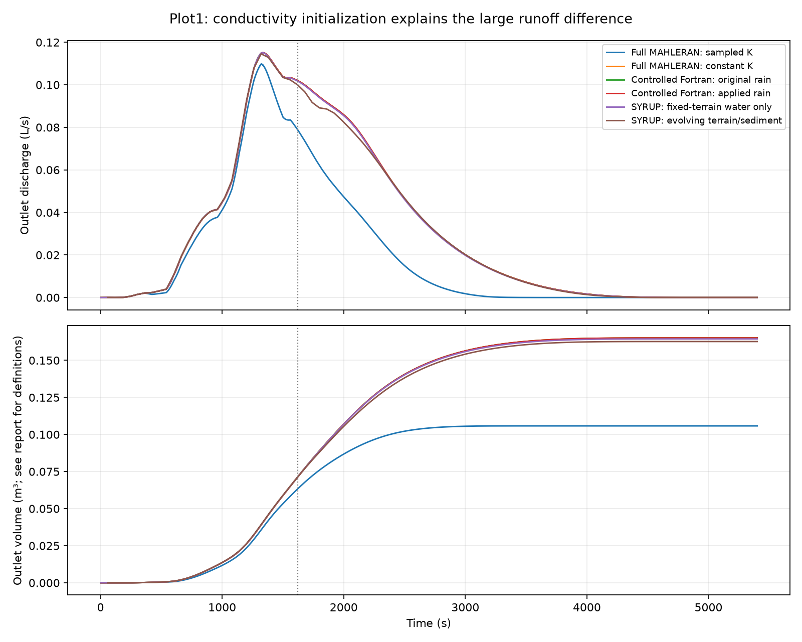

# Independent initialization and runoff audit

User authorized this task on2026-09-30 explicitly without Claude involvement.
Codex investigated and verified it independently. No new SYRUP event was run,
no production model changed, and no original MAHLERAN/MAPLE file changed.
Earlier independent-review queues remain separate; this task was not sent to Claude.

## Finding

The large runoff difference is primarily explained by **different conductivity
initialization**, not evidence that the water-routing port fails. The full Plot1
XML requests normal conductivity with mean0.00025mm/s and standard deviation
0.001mm/s. `calculate_surface_properties_from_types.f90` rejects nonpositive
samples and draws again. Consequently the accepted distribution's mean is
higher than the supplied normal location parameter. Its saved interior field
has mean0.0008790302mm/s (3.516 times the nominal mean), minimum0.000001627 and
maximum0.003009mm/s. These statistics inherit the map's output rounding.

The earlier controlled original-Fortran benchmark and SYRUP explicitly used
constant0.00025mm/s. That simplification was already recorded in
`column_experiment.plot1_parameters` and the earlier benchmark provenance;
it was not a reproduction of the full application's random realization.
Positive-sample rejection is explicit legacy behavior, not a newly discovered
implementation error. This audit does not recommend deleting heterogeneity.

`MAHLERAN_storm_setting_xml.f90:430` selects the distribution;
`calculate_surface_properties_from_types.f90:119` implements positive normal
sampling. `infilt.for:69` uses the Hawkins rainfall/pavement relationship during
rain, conductivity when rain is zero, and conductivity in drainage at line103.
Thus the initialization affects recession especially strongly.

## Controlled experiments

1. Preserved the original successful run. Made a new prepared copy
   `outputs/phase7/mahleran_deterministic_ksat`; changed only XML
   `finalInfiltrationRateDistribution` from `normal` to `deterministic`.
   Used the same SHA-bound full-model executable, with runtime checks.
   Run `outputs/phase7/mahleran_deterministic_ksat_run` completed all5400steps.
   Its output conductivity map is uniformly0.00025mm/s.
2. Reused the previously built controlled original-Fortran executable, replacing
   only its5400 input rainfall rates with the full application's logged applied
   rates. No source recompiled or modified. Run
   `outputs/phase7/controlled_fortran_applied_rain` completed, with finite
   5400×12 history and its expected completion marker. Exact input/executable
   hashes and commands are in its execution.json. Reproduction script is
   `agent_handoffs/tasks/phase7_initialization_audit/replay_forcing.py`.

These are isolated diagnostic configurations, not replacement accepted models.

| Run | Sum of one-second endpoint outlet Q × dt (m³) |
|---|---:|
| Full MAHLERAN, original sampled conductivity | 0.1057948743 |
| Full MAHLERAN, constant conductivity only | 0.1650897739 |
| Controlled Fortran, constant conductivity, original interval rainfall | 0.1650727223 |
| Controlled Fortran, constant conductivity, actual applied legacy rainfall | 0.1650896316 |

The final pair differs by0.00008618% in integrated endpoint discharge.
Hydrograph RMSE is8.34e-9m³/s; maximum absolute difference is5.00004e-8m³/s,
approximately half the last printed digit near the peak. This is agreement at
roughly stock-output precision, not bitwise or full-state equivalence. The full
run has a rounded maximum plateau from1328–1342s; the controlled peak at1335s
lies inside it. Do not interpret the first rounded peak as a timing failure.

Changing conductivity adds0.05929490m³ runoff:0.00799223m³ through1620s and
0.05130267m³ afterward. About86.5% of that effect occurs after the nominal
rainfall end. Full-model rain ends one legacy step later; these windows use the
same1620s cut for comparison. Earlier divergence also occurs at rainfall changes.

## Initialization checks and remaining qualifications

- Initial routing matches all1200cells after north/south row conversion.
- Saturated-moisture and rainfall-scaling input maps match imported SYRUP arrays
  exactly; physical interior rain scaling is1 throughout.
- Saved pavement matches SYRUP's converted pavement to3.82e-10 in legacy units,
  consistent with output/legacy precision.
- XML/parameter-log settings agree with the controlled setup: initial moisture
  0.25, soil thickness0.3m, suction46.6mm, drainage parameter0.05, constant
  friction21.45, infiltration model2/parameter type2, method5/D4 routing.
  This is configuration/source evidence, not a fresh internal-state dump for
  every parameter. Numerical whole-hydrograph agreement further supports it.
- The original rain schedule integrates to9.652mm; logged applied forcing is
  9.656233333mm. Its transition timing must be matched explicitly.
- Neither full run updates terrain. Existing coupled SYRUP output evolves terrain.

Important accounting distinction: stock MAHLERAN Q is endpoint discharge,
whereas the controlled driver and SYRUP also maintain timestep-integrated face
export. The controlled applied-rain run's actual CN export ledger is
0.1650735190m³, versus0.1650896316m³ from summing endpoint Q. This is why directly
subtracting previously quoted ledger totals from stock Q integrals slightly
misstates the remaining discrepancy. Our comparison now uses identical output
observables. Do not alter MAPLE conservation tolerances to accommodate rounded
legacy files.

The earlier matched constant-conductivity, exact-interval water-only comparison
still stands: SYRUP ledger0.1644330883m³ versus original-routine ledger
0.1650566104m³ at1s, a0.378% difference that decreases with timestep. That earlier
experiment identified legacy stale-inflow water creation and numerical effects.
The existing evolving-terrain SYRUP ledger0.1626808193m³ is another configuration;
its remaining difference is not isolated by this audit.

Top panel uses saved endpoint discharge; evolving SYRUP is only saved every60s,
so its displayed maximum is a sampled maximum. Bottom panel uses summed
one-second endpoint discharge for Fortran runs and recorded conservative
cumulative exports for SYRUP. Those integration definitions differ slightly,
as quantified above. Sparse SYRUP discharge samples are not integrated to invent
an export ledger. All metrics and file hashes: `initialization_comparison.json`;
parameter checks: `initialization_parameters.json`.

## Next comparison specification (not implemented)

Use the deterministic full MAHLERAN variant for the first matched test because
it matches the already-tested SYRUP initialization. Preserve the original
heterogeneous run for a later test importing its exact conductivity realization
(preferably full precision), rather than trying to match RNG seeds across languages.

Feed the same effective rainfall intervals to both models; bind the override's
hash and units while preserving original case provenance. Keep DEM, slopes,
aspects, receivers, ordering, friction and outlet definitions fixed throughout.
Prevent hydraulic elevation/routing changes at intermediate commits, event-end
commits, avalanching and restart; preserve conservative MAPLE holdings, active
layer refill, pickup, deposition and class exports. Hydraulic geometry and
sediment inventory must be explicit separate views for this diagnostic.

Compare all5400seconds at1s output cadence. If SYRUP completes sooner, distinguish
its actual completion from any explicitly defined zero-flux reporting extension;
do not compare reset soil water to MAHLERAN's undried final state. Save pre-reset
water and mobile sediment separately. Record instantaneous outlet Q alongside
integrated export, class export rates/ledgers, wet spatial snapshots and maxima.
Use output-aware error measures for rounded legacy data and unchanged MAPLE
bounds for SYRUP internal closure. Refine timestep before attributing residual
hydraulic differences to physics. Full sediment fidelity, bed-composition
feedbacks, transport timing, GPU behavior and speed equivalence remain unproved.
