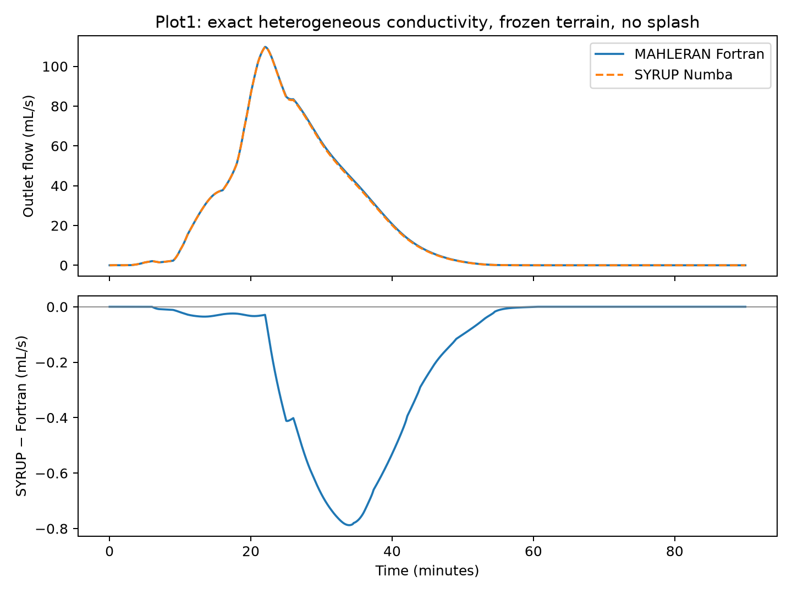

# Heterogeneous Plot1 hydrology qualification

Status: accepted heterogeneous Plot1 CPU hydrology qualification. This is a
case-specific CPU hydrology qualification against executed original Fortran. It
does not qualify sediment, changing terrain, the GPU backend, or every MAHLERAN option.

The current prepared Numba hydrology passes the predeclared runoff, peak-flow,
peak-time and spatial targets on the actual heterogeneous Plot1 realization.
No production source or scientific conservation tolerance changed in this task.
[Complete measurements](measurements.json) and [reproduction scripts](../../benchmarks/phase7i/README.md).

## Matched inputs and reference

Plot1: 60 × 20 active cells, 0.5 m spacing, 5400 seconds; frozen elevation and
routing, method-5/D4 hydraulics, friction type 1, pavement/Hawkins infiltration.
No splash, evapotranspiration or dry reset. The benchmark initializes the actual
MAPLE case but never exchanges sediment or changes its bed; bed digests agree.
The selected MAPLE package remains `72310c49ae3b2db99f8ab919669303e98b14ee4479eb17522e5f6ad7ff474f65`.

An isolated derivative of the existing heterogeneous no-splash application adds
four read-only hooks in the storm driver. Original hydrology equations, random
sampling, rainfall switching, state updates and all other compiled sources remain
unchanged. Removing the hooks restores the parent driver byte for byte. The
checked build compiled 95 sources; the instrumented storm source emitted no
compiler warning. All 5400 steps completed.

All **14 original numerical output files are byte-identical** to the earlier
heterogeneous MAHLERAN run. Capture-derived discharge rounds to every stock
hydrograph row; captured peak snapshots exactly equal MAHLERAN's internal
`dmax`/`vmax`. The new full-precision capture is the numerical reference; rounded
file identity alone is not asserted as proof of unprinted-state identity.

The captured conductivity has mean **0.0008790293951 mm/s**, minimum
0.000001626947792 and maximum 0.0030088438603 mm/s. SYRUP imports this field,
not a fresh random sample or the nominal XML mean of 0.00025 mm/s.
MAHLERAN's positive-truncated sampling is retained unchanged.

Rain is captured immediately before infiltration, including the legacy switching
lag and actual REAL32 rainfall values. Applied depth is **9.6562332166 mm**
(2.8968699650 m³); this differs slightly from the rounded-log reconstruction.
The full-grid import sidecar is south-first too: reverse it when comparing to
Fortran's north-first full mask. The perimeter has 22 negative export-mask cells
and 142 non-export mask cells; there are 10 physical outlet cells. The exact full
mask and active/outlet geometry are checked, rather than assuming every perimeter
cell exports. Perimeter cells lie outside the infiltration loop.

Legacy `soil_thick` is REAL32: the XML 0.3 m becomes 0.30000001192092896 m.
The benchmark verifies captured maximum storage and initial soil against that
representation, then binds captured SI storage and initial soil. Initial soil
water is 22.5000008941 m³. Other hydraulic/soil fields undergo explicit consistency
checks. This matches initialization; it does not relax any target or change
SYRUP's production defaults.

## One-second results

Targets were recorded before execution: runoff and peak discharge within 1%,
peak time within the reference's rounded maximum plateau ±10 s, and peak-snapshot
depth/velocity relative L2 within 1%. Comparison bounds between prepared/reference
SYRUP remain `rtol=2e-12`, `atol=1e-14`; original local and MAPLE-derived event
conservation tolerances are unchanged.

| Quantity | MAHLERAN full precision | SYRUP | Difference |
|---|---:|---:|---:|
| Endpoint outlet integral (m³) | 0.1057943910 | 0.1049661013 | −0.782924% |
| Peak outlet discharge (m³/s) | 0.0001097796814 | 0.0001097506073 | −0.026484% |
| Exact peak time (s) | 1321 | 1321 | 0 s |
| Depth field at own outlet peak, relative L2 | reference | — | 0.023785% |
| Velocity field at own outlet peak, relative L2 | reference | — | 0.011120% |

Hydrograph NSE is 0.9999058600; RMSE is 2.904898e-7 m³/s. Maximum spatial
errors are 0.00189814 mm depth and 0.00865417 mm/s velocity. Both models are
naturally surface-dry at 5400 s, so final-depth relative error is undefined and
exact zero agreement is reported. Final soil and cumulative drainage relative L2
errors are 0.004653% and 0.004266% respectively.

**All declared targets pass.** Endpoint ΣQdt and conservative CN face export
are different observables: SYRUP's face export is 0.1049401621 m³, not the
0.1049661013 m³ endpoint integral. Both are saved and labelled.

SYRUP's one-second event budget residual is −1.776e-15 m³ under its unchanged
MAPLE-derived 5.811e-7 m³ bound. Prepared/reference lockstep validates **36 public
fields over all 5400 steps**, with no structural mismatches, identical regime
counts, and a largest normalized comparison error of 0.1762 (passing bound = 1).

## Timestep sensitivity and legacy water surplus

The unchanged controlled Fortran driver reproduces the full application's
**entire full-precision outlet series exactly** at one second. It then reuses the
same static fields and applied forcing at half/quarter-second steps; these are
original-routine controlled runs, not additional full-application runs. Rates
are held constant over their captured whole-second intervals, not interpolated.

| Common timestep (s) | Fortran native endpoint integral (m³) | SYRUP native endpoint integral (m³) | SYRUP difference |
|---:|---:|---:|---:|
| 1 | 0.1057943910 | 0.1049661013 | −0.782924% |
| 0.5 | 0.1053912901 | 0.1049787140 | −0.391471% |
| 0.25 | 0.1051909477 | 0.1049850435 | −0.195743% |

These native integrals use every model step; one-second sampled series are saved
separately. SYRUP face export changes by 0.03659% from 1 to 0.25 s. All SYRUP
budgets and comparison targets against the full application's dt1 series also
pass. All exact outlet peaks remain at 1321 s.

The one-second original Fortran water surplus is **0.0014815129 m³**.
The unchanged driver's diagnostics separate 0.0014812898 m³ stale-inflow gain
and 2.2307744e-7 m³ root closure residual, leaving 5.29e-14 m³ unexplained.
No bracket truncations are detected in this case. Surplus decreases to
0.0007385527 and 0.0003693631 m³ at smaller steps. This and the narrowing
matched-timestep runoff gap support the legacy flux inconsistency as a major
cause of the difference; they do not uniquely attribute every outlet difference.
SYRUP retains its consistent sender/receiver old fluxes and proven root bracket.

## Verification and limits

Final benchmark plus compiled hydrology regression: **167 passed, 1 GPU-dependent
skip in 16.55 s**. Focused input-binding tests, source-reversibility tests,
full-storm parity, three controlled original-Fortran storms and three SYRUP storms
executed. Ruff passes. Original reference trees, pinned MAPLE and every production
SYRUP module hash match the baseline `98f144f`.

Claude authored the bounded harness and first correction; Codex independently
reviewed, executed checks and corrected the unique end-loop anchor and captured
soil/boundary binding. Task evidence and raw outputs reside under
`agent_handoffs/tasks/phase7i_heterogeneous_hydrology` and `outputs/phase7i`.
The measurement record includes source/executable/input/output bindings. Timings
are observational; overlapping diagnostic jobs were not a speed benchmark.

Qualified: this heterogeneous Plot1 CPU hydrology benchmark. The normal legacy
CLI retains its previous initialization defaults; this exact-field benchmark
runner explicitly supplies the captured realization. Broad heterogeneous-case
coverage, other infiltration/friction choices, terrain evolution, GPU hydrology
and sediment fidelity remain separate qualifications. The known strict roundoff
guard limitation is unchanged and did not trigger in these storms. Final Claude review found no material blocking defect in the corrections or report; Codex independently verified the actual runs, hashes and test results. Full-mask equality is mandatory in this benchmark runner; the shared diagnostic helper permits reduced synthetic fixtures. The qualification was committed and pushed on subsequent user instruction.
